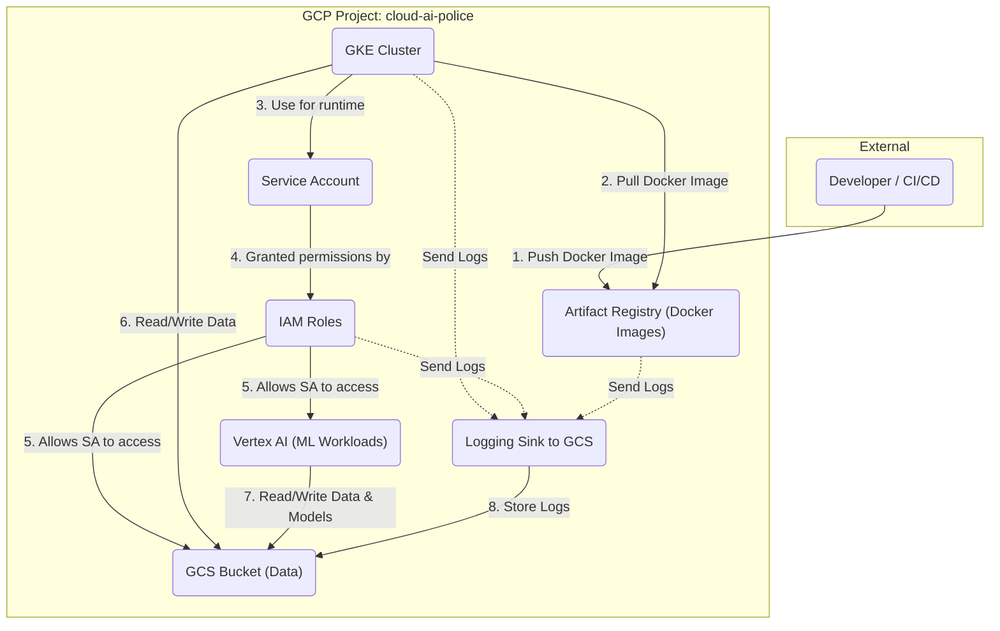

# Infrastructure Diagram

This document provides a high-level overview of the infrastructure managed by this Terraform configuration, visualized as a Mermaid diagram.

## Explanation of the Flow

1.  **GCP Project:** The `cloud-ai-police` project is the top-level container for all the resources.
2.  **Service Account (SA):** A dedicated service account is used by resources within the project to interact with each other securely.
3.  **IAM Roles:** The service account is granted specific permissions through IAM roles, defining what it's allowed to do.
4.  **Resource Interactions:**
    *   **Developer/CI-CD:** Pushes Docker container images to the **Artifact Registry (GAR)**.
    *   **GKE Cluster:** Pulls these images from GAR to run applications. The cluster uses the **Service Account** to authenticate with other Google Cloud services.
    *   **GCS Bucket:** Stores and serves data. Both the **GKE Cluster** and **Vertex AI** can read from and write to the bucket, as allowed by the IAM roles.
    *   **Vertex AI:** Used for machine learning workloads, often accessing data from the **GCS Bucket**.
